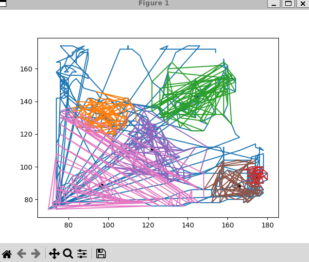

# DotA et analyse de trajectoires

Ce projet a été réalisé au 2nd semestre de 3eme année de licence informatique.
Il a été réalisé en groupe de 4.
Il est possible que ce ne soit pas la dernière version réalisé mais c'est la seul version que j'ai retrouvé.
Ceci est une courte présentation du projet.

### Présentation jeu Dota

Dota est un jeux video de type arene de bataille en ligne multijoueur creer
par Valve Corporation. Dota 2 se joue en matches independants opposant deux
equipes de cinq joueurs, chacune possedant une base situee en coin de carte
contenant un batiment appele l'< Ancient >, dont la destruction mène à la
victoire de l'equipe ennemie. Chaque joueur contrôle un < Heros > et est amené
a accumuler de l'experience, gagner de l'or, s'equiper d'objets et combattre
l'equipe ennemie pour parvenir a la victoire. Si l'on se met a la place des
developpeurs de Dota 2, il est important de recuperer des données et d'appliquer
des corrections pour assurer la continuité du jeu. C'est l'aspect du traitement
de données qui nous intéresse.

#### Problématique

Dota 2 est un jeu complexe qui necessite un equilibrage pour assurer sa
continuité. Les développeurs ont donc besoin de récupérer des données de parties
et de les analyser. Nous nous placons dans le rôle d'un informaticien dont le but
est de traitée le jeu de données. Dans notre cas on s'intéresse aux mouvements
des joueurs sur la carte et - à partir de données de parties - nous allons faire en
sorte de recuperer les positions en fonctions du temps et les changer en cluster
de trajectoires. La question que l'on se pose est pourquoi faire des clusters et
quel algorithme entre le K-moyenne et la propagation d'affinité est le meilleur
pour traiter ce genre de données.

#### Analyse de trajectoires

Le projet "Dota et analyse de trajectoires" consiste a recuperer des
donnees de plusieurs simulation de jeu Dota, recupérer et afficher les trajectoires
des joueurs et enfin les analyser en utilisant plusieurs algorithmes tel que k-
means et la propagation d'affinite et comparer les resultats obtenue des deux
algorithmes.

---

### Information
Le programme prend du temps a s'executer en raison de la grande com-
plexité des différent programme et des algorithmes utilisé.

#### K_means
Voici ce qu'on obtient en lançant k_means:

Le principe de l'algorithme k-moyennes est constitué de 4 etapes dont deux
qui se répètent jusqu'a avoir un résultat optimal. La première étapes est de
recuperer les données. La deuxième est de placer k cluster au hasard parmi les points. 
La troisième étape est d'assigner à chaque cluster les points les plus
proches et enfin la quatrième est de modifier le centre du cluster en faisant la
moyennes de toute les points assignes a ceux cluster. Les étapes trois et quatre
se répètent jusqu'à atteindre le résultat optimal.

#### Propagation d'afinité
La propagation d'affinite est une methode de classification recursive qui
classe les clusters de trajectoire par groupe en fonction de leur "affinite". Par
affinité, il faut comprendre une relation entre trajectoire. Le principe de cette
classification est qu'on test cette affinite pour chaque clusters par apport aux
autres. D'un point de vue mathématique, on effectue la classification grâce au
calcul de trois matrices par apport au jeu de valeurs. On calcul alors les matrices
de similarités, de disponibilité et de fiabilité. La première matrice est utilisée
pour calculer les deux dernières et en les additionnant, on obtient la matrice
d'affinité.

#### Les tests
Nous avons r´ealis´e une class de test qui permet de tester nos diff´erents programmes
pour v´erifier que le format, type ou encore que le r´esultat soit correct.

---

### Lancement
Il est necessaire d'avoir certain module python télécharger pour que ça fonction comme par exempl:
numpy
matplotlib

Instructions :

Pour lancer le programme : 
    - Ouvrir un terminal dans le dossier principal "PROJET-DOTA-LALOUX-ROZIER-JOUIN-FAVIER/"
    - taper la commande "python3 -m main propa_affin" pour lancer la propagation d'affinité  (ne fonctionne pas donc j'ai peut-etre pas réussi à retrouver la dernière version)
    - taper la commande "python3 -m main k_means" pour lancer le K-moyenne
    - taper la commande "python3 -m main" pour lancer les tests
L'exécution du programme prends du temps. C'est normal, les algorithme sont lourd. Temps d'exécution d'environ 2 minutes 30 secondes.
A la fin de l'exécution du programme, on affiche dans le terminal les résultat de la propagation d'affinité et dans une fenêtre graphique, le k-moyenne.
Le k -moyenne possède une interfae graphique qui affiche le résultat de tous les joueurs d'une équipe, du premier au dernier. Pour passer à la fenêtre suiante,v il faut fermer la fenêtre actuelle.

---

### Conclusion
#### Ce que nous n'avons pas eu le temps de faire
Nous avons pas eu le temps de :
- Par manque de temps, il n'a pas été possible de traiter les données pour
extraire les régularités de mouvements de chaque équipes. On avait commencé à regarder pour une implementation
de l'algorithme de PréfixSpan, mais au vu de la difficultés de la tâche, nous avons préférer
consolider ce que l'on avait fait.
- Toujours par manque de temps, nous n'avons pas cherché à re-coder nos
trajectoires en suite de segments.
- Enfin, pour la plupart nous avons seulement implemente les algorithmes
presentes dans nos sources salns chercher a les optimiser. L'idee était
avant-tout d'avoir un resultat.

#### Ce que nous n'avons pas réussi à faire
Ce que nous avons pas réussi faire :
- Nous n'avons pas été en mesure d'exploiter le resultat de la propagation
d'affinite. En effet, l'algorithme ressort un ensemble de norme de clusters
et ceux dont la norme est positive sont des coeurs de clusters qui auraient
permis de classifier les autres clusters. Le problème est qu'il n'a pas été
possible d'utiliser ces valeurs et de les afficher pour faire un comparatif
avec le K-moyenne.

#### Conclusion
La realisation de ce projet etait complexe pour nous tous. En realite la
difficulté principale a été de comprendre les sources fournies ainsi que les algo-
rithmes. Une autre difficulté est le principe de changer les positions en trajec-
toires qui nous paraissait ambigue au debut. L'intérêt principal que nous avons
eu a ete de regrouper les donnees en clusters pour faciliter le traitement de ces
données et de les classifier grace au K-moyenne. L'extraction des données n'a
pas pu être effectuée et c'est quelque peu dommage car tout l'intérêt du traite-
ment est de pouvoir "faire parler" la donnée et en tirer une conclusion. Même si
nous ne pouvons que partiellement répondre a notre problématique de départ,
voici ce que l'on déduit :
Le clustering en informatique est très important pour simplifier les calculs
- Le traitement de donnees est indispensable pour pouvoir ameliorer un
programme.
- Nous avons a peine effleure le principe de regroupement des donnees en
clusters.
- Le K-moyenne est un algorithme fonctionnant sur le principe de voisi-
nage. Il fonctionne dans beaucoup de cas mais ne permet pas de tirer
beaucoup de conclusion. Il reste neanmoins plus facile a implémenter et
plus rapide que la propagation d'affinité.
- La propagation d'affinité est plus complexe et plus long à implémenter.
Cet algorithme permet de tirer plus de conclusions que le K-moyenne.
Par exemple, en observant le trafic aérien, il est capable de détecter où
se situent les aéroports.

